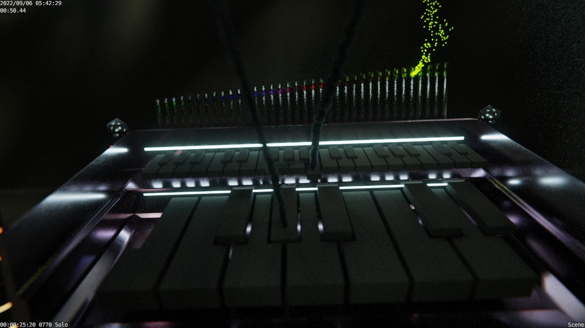
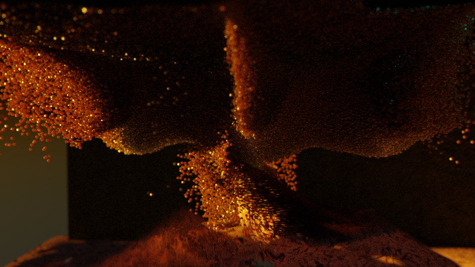

# Alembic Point Clouds

The goal of this branch is to present an up-to-date Blender release with support for alembic point clouds.

Ultimately, this is an implementation of [D11591](https://developer.blender.org/D11591) and [D11592](https://developer.blender.org/D11592) (authored by **Kévin Dietrich (kevindietrich)**) with changes made by myself to support Blenders new attribute API.

**Why??**

For me, ultimately I need to create particle simulations in Houdini and have them rendered in Blender.

## History

https://developer.blender.org/D11591 and https://developer.blender.org/D11592 are pretty substantial changes to Alembic importing, and will likely take some time to be integrated into blender proper.

However, we need point clouds! So if you are down with some risk, this branch should help you get things done.

Specifically I needed:
- Importing attributes from Houdini like Cd, velocity, and other custom attributes in Blender shaders.

## Previews

These are all point clouds exported in Houdini and rendered with this code.

## Weird

The current annoying thing I have to do is use geometry nodes to apply the material to the point cloud, even if its set on top.
I'm still working through some weirdness.